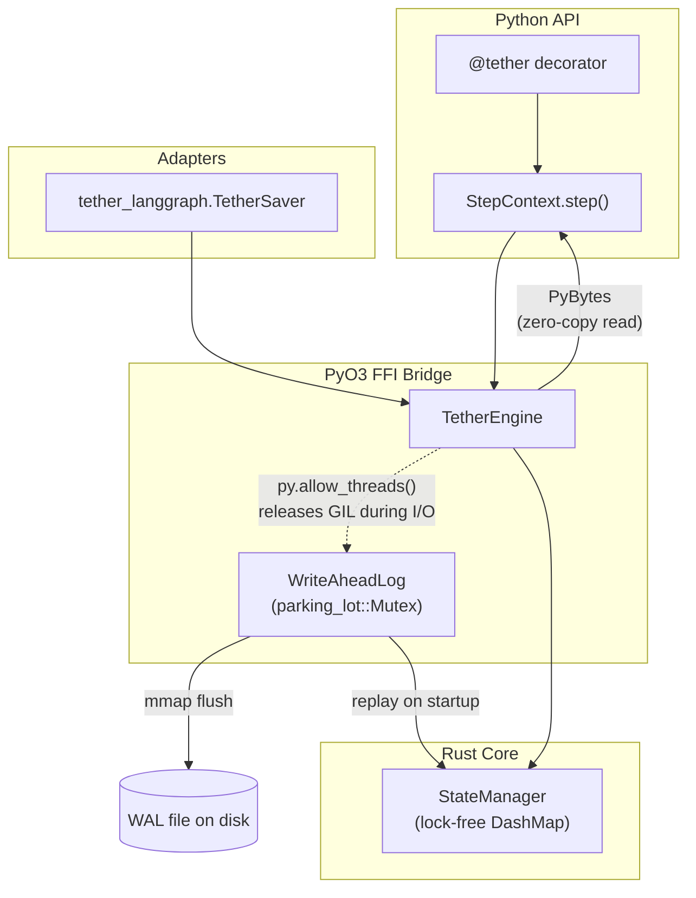

# Tether

An embedded, zero-copy, durable execution engine for AI agents. Tether wraps
volatile, crash-prone Python workflows in a crash-proof layer backed by a
custom Rust write-ahead log — no SQLite, no external database.

Drop-in replacement for LangGraph checkpointers: swap `SqliteSaver` for
`TetherSaver` (see [`tether_langgraph`](python_pkg/tether_langgraph/)) and
LangGraph's state persists through the same Rust WAL.

## 30-Second Quickstart

```python
import asyncio
from tether import tether, StepContext

# The user just writes normal async Python code.
# The @tether decorator makes it crash-proof.
@tether(name="research_agent")
async def research_agent_task(ticker_symbol: str):
    context = StepContext()  # Auto-injected state manager

    # Step 1: If this crashes, it saves the result.
    stock_data = await context.step("fetch_data", get_stock_data, ticker_symbol)

    # Step 2: If this crashes, it DOES NOT re-call the LLM!
    analysis = await context.step("analyze", call_llm, stock_data)

    # Step 3: Save to DB.
    await context.step("save", save_to_db, analysis)

    return analysis

# Run it. If the server loses power at Step 2,
# it resumes exactly at Step 2 when it restarts.
if __name__ == "__main__":
    asyncio.run(research_agent_task("AAPL"))
```

Each `context.step(name, fn, *args)` call is checked against the WAL before
running: if `name` already has a committed result from a prior run, `fn` is
skipped entirely and the saved result is returned. If `fn` raises, nothing is
committed, so the step retries on the next run. A step that already finished
is never re-executed — the guarantee this project exists for.

## Install (development)

Pre-built wheels aren't published yet. To build from source:

```bash
pip install maturin
maturin develop  # builds the Rust extension and installs it into your venv
```

## Architecture



See [ARCHITECTURE.md](ARCHITECTURE.md) for the full design: the WAL's
write/commit record format, the 2-phase-commit state machine, the zero-copy
FFI boundary, and the GIL-release strategy.

## Project layout

- `rust_core/src/` — the Rust engine: `wal.rs` (write-ahead log), `state.rs`
  (2PC state machine), `lib.rs` (PyO3 bindings).
- `python_pkg/tether/` — the Python API: `@tether`, `StepContext`.
- `python_pkg/tether_langgraph/` — `TetherSaver`, a `BaseCheckpointSaver`
  implementation for LangGraph.
- `tests/` — Rust tests live next to their modules (`cargo test`); Python
  tests are under `tests/` (`pytest`), including a chaos suite that kills a
  real subprocess mid-workflow to prove recovery.

## Status

Core engine (WAL, 2PC state machine, FFI bridge, Python API, LangGraph
adapter) is implemented and tested. No published wheels yet — see
[BENCHMARKS.md](BENCHMARKS.md) for the not-yet-run performance comparison
against LangGraph's SQLite checkpointer.
