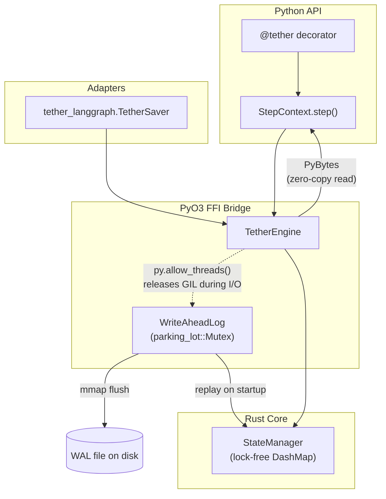

# Tether

[](LICENSE)
[](rust_core/Cargo.toml)
[](pyproject.toml)

**Tether makes crash-prone AI agent workflows crash-proof, without a database.**

Long-running agents call expensive things — LLMs, tool calls, web requests —
in sequence. If the process dies halfway through, most frameworks either lose
all progress or bolt on Postgres/SQLite just to checkpoint state. Tether is
an embedded durability layer: a `@tether` decorator plus a custom Rust
write-ahead log, so a step that already completed is never re-run, and there
is nothing to install, host, or configure.

- **No SQLite, no external database.** State lives in a WAL file next to
  your code.
- **Drop-in for LangGraph.** Swap `SqliteSaver` for `TetherSaver` (see
  [`tether_langgraph`](python_pkg/tether_langgraph/)) — same interface, same
  Rust WAL underneath, no code changes beyond the import.
- **Zero-copy, GIL-aware.** Large payloads (LLM context) cross the
  Python/Rust boundary via buffer protocol, not JSON. Disk I/O releases the
  GIL so other Python work keeps running.

## 30-Second Quickstart

```python
import asyncio
from tether import tether, StepContext

# The user just writes normal async Python code.
# The @tether decorator makes it crash-proof.
@tether(name="research_agent")
async def research_agent_task(ticker_symbol: str):
    context = StepContext()  # Auto-injected state manager

    # Step 1: If this crashes, it saves the result.
    stock_data = await context.step("fetch_data", get_stock_data, ticker_symbol)

    # Step 2: If this crashes, it DOES NOT re-call the LLM!
    analysis = await context.step("analyze", call_llm, stock_data)

    # Step 3: Save to DB.
    await context.step("save", save_to_db, analysis)

    return analysis

# Run it. If the server loses power at Step 2,
# it resumes exactly at Step 2 when it restarts.
if __name__ == "__main__":
    asyncio.run(research_agent_task("AAPL"))
```

Each `context.step(name, fn, *args)` call is checked against the WAL before
running: if `name` already has a committed result from a prior run, `fn` is
skipped entirely and the saved result is returned. If `fn` raises, nothing is
committed, so the step retries on the next run. A step that already finished
is never re-executed — the guarantee this project exists for.

## Why not just use LangGraph's SQLite checkpointer?

| | LangGraph + SQLite | Tether |
|---|---|---|
| External dependency | SQLite file + driver | None |
| Large-payload handling | Serialize to JSON, copy | Zero-copy buffer protocol |
| Concurrency | SQLite locking | Lock-free (`DashMap`) |
| LangGraph integration | Native | Drop-in via `TetherSaver` |
| Use outside LangGraph | No | Yes — plain `@tether` decorator |

If you're not on LangGraph at all, Tether still works as a standalone
durability layer for any async Python workflow.

## Install (development)

Pre-built wheels aren't published yet. To build from source:

```bash
pip install maturin
maturin develop  # builds the Rust extension and installs it into your venv
```

## Architecture



See [ARCHITECTURE.md](ARCHITECTURE.md) for the full design: the WAL's
write/commit record format, the 2-phase-commit state machine, the zero-copy
FFI boundary, and the GIL-release strategy.

## Project layout

- `rust_core/src/` — the Rust engine: `wal.rs` (write-ahead log), `state.rs`
  (2PC state machine), `lib.rs` (PyO3 bindings).
- `python_pkg/tether/` — the Python API: `@tether`, `StepContext`.
- `python_pkg/tether_langgraph/` — `TetherSaver`, a `BaseCheckpointSaver`
  implementation for LangGraph.
- `tests/` — Rust tests live next to their modules (`cargo test`); Python
  tests are under `tests/` (`pytest`), including a chaos suite that kills a
  real subprocess mid-workflow to prove recovery.

## Status

Core engine (WAL, 2PC state machine, FFI bridge, Python API, LangGraph
adapter) is implemented and tested, including a chaos suite that kills a
real subprocess mid-workflow. No published wheels yet — see
[BENCHMARKS.md](BENCHMARKS.md) for the not-yet-run performance comparison
against LangGraph's SQLite checkpointer.

This is an early-stage project. APIs may change before a 1.0 release.

## Contributing

Small, focused PRs welcome — see [CONTRIBUTING.md](CONTRIBUTING.md) for the
project's rules (no SQLite, no panics across FFI, no `std::sync::Mutex`
across the boundary) and how to run the test suite.

## License

[MIT](LICENSE)
